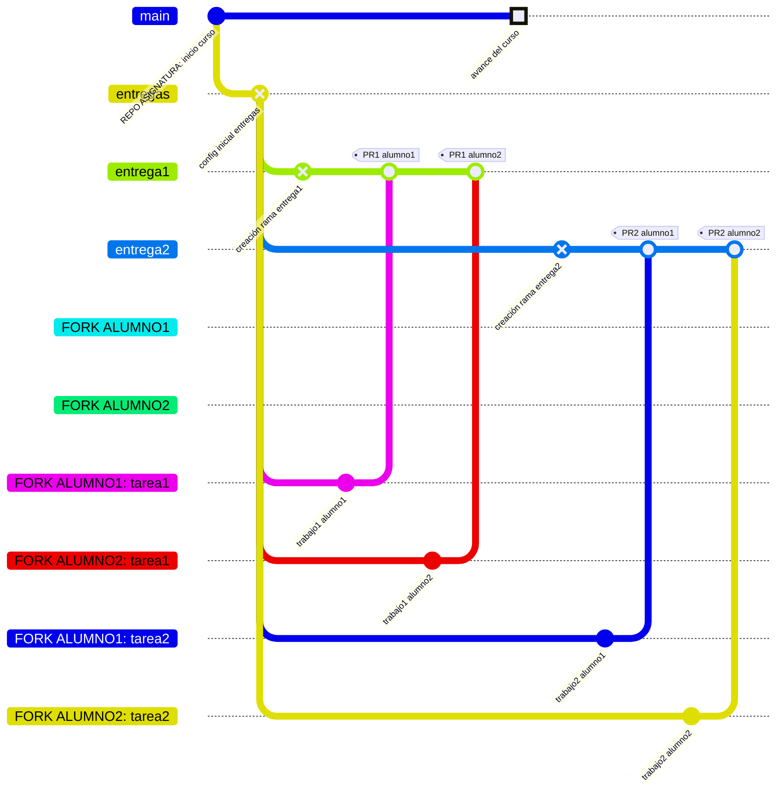

# 👨‍💻 Programación II - RAMA DE ENTREGAS

Usamos esta rama para las entregas, tal y como lo especificamos con más detalle en el artículo de [flujoGIT](/documentos/flujoGIT.md)

```mermaid
%%{init: {
  'theme': 'base',
  'gitGraph': {
    'showBranches': true,
    'showCommitLabel': true,
    'mainBranchName': 'main',
    'mainBranchOrder': 0
  },
  'themeVariables': {
    'git0': '#E64A19',     # main: naranja oscuro
    'git1': '#388E3C',     # entregas: verde oscuro
    'git2': '#1976D2',     # entrega1: azul
    'git3': '#7B1FA2',     # entrega2: morado
    'git4': '#82B1FF',     # alumno1: azul claro
    'git5': '#B39DDB',     # alumno2: morado claro
    'commitLabelColor': '#000000',
    'commitLabelBackground': '#FFFFFF',
    'tagLabelColor': '#000000',
    'tagLabelBackground': '#FFE0B2',
    'tagLabelBorder': '#FB8C00'
  }
}}%%
gitGraph
    commit id: "REPO ASIGNATURA: inicio curso"
    branch entregas order: 1
    checkout entregas
    commit id: "config inicial entregas" type: REVERSE
    
    %% Forks iniciales de los alumnos
    branch "FORK ALUMNO1" order: 4
    branch "FORK ALUMNO2" order: 5
    
    %% Creación Entrega1 y trabajo
    checkout entregas
    branch entrega1 order: 2
    commit id: "creación rama entrega1" type: REVERSE
    
    checkout "FORK ALUMNO1"
    branch "FORK ALUMNO1: tarea1" order: 6
    commit id: "trabajo1 alumno1"
    checkout entrega1
    merge "FORK ALUMNO1: tarea1" tag: "PR1 alumno1"
    
    checkout "FORK ALUMNO2"
    branch "FORK ALUMNO2: tarea1" order: 7
    commit id: "trabajo1 alumno2"
    checkout entrega1
    merge "FORK ALUMNO2: tarea1" tag: "PR1 alumno2"
    
    %% Avanza el curso, nueva entrega
    checkout main
    commit id: "avance del curso" type: HIGHLIGHT
    
    %% Creación Entrega2 y trabajo
    checkout entregas
    branch entrega2 order: 3
    commit id: "creación rama entrega2" type: REVERSE
    
    checkout "FORK ALUMNO1"
    branch "FORK ALUMNO1: tarea2" order: 8
    commit id: "trabajo2 alumno1"
    checkout entrega2
    merge "FORK ALUMNO1: tarea2" tag: "PR2 alumno1"
    
    checkout "FORK ALUMNO2"
    branch "FORK ALUMNO2: tarea2" order: 9
    commit id: "trabajo2 alumno2"
    checkout entrega2
    merge "FORK ALUMNO2: tarea2" tag: "PR2 alumno2"
```

