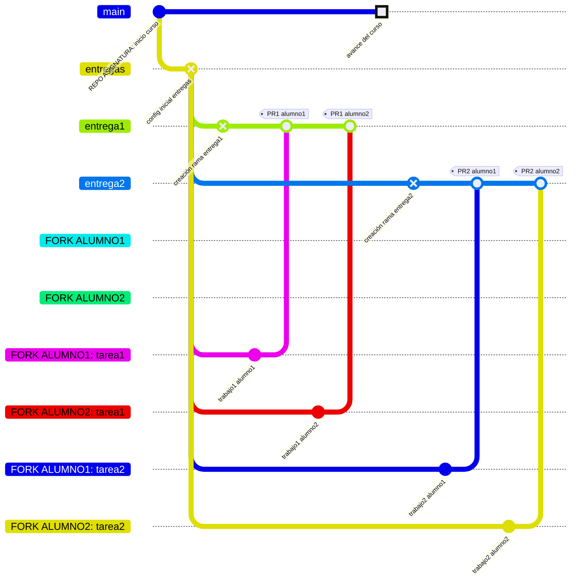

# Trabajando con GIT

## ¿Por qué?

La gestión del código y las entregas en una asignatura de programación requiere un sistema que permita:

- Mantener el material del curso actualizado para todos los alumnos.
- Gestionar las entregas de forma organizada.
- Tener un histórico claro de los cambios y evolución del trabajo.
- Simular un entorno profesional real de desarrollo.

Git y GitHub proporcionan las herramientas necesarias para conseguir estos objetivos mediante un flujo de trabajo claro y organizado.

## ¿Qué?

El sistema se basa en:

- Un repositorio principal de la asignatura con dos ramas principales:
  - `main`: contiene el material y recursos del curso.
  - `entregas`: rama base para la gestión de entregas.
- Ramas específicas para cada entrega (`entrega1`, `entrega2`, etc.) que se crearán según avance el curso.
- Forks individuales para cada alumno donde:
  - Se mantendrá sincronizado el material del curso.
  - Se trabajará en las entregas en las ramas correspondientes.
  - Cada alumno trabajará en su propia carpeta dentro de `/entregas/apellidoNombre/`.

## ¿Para qué?

Esta estructura permite:

- Separar claramente el contenido del curso de las entregas.
- Evitar mezclar el trabajo de diferentes alumnos.
- Mantener un histórico limpio de las entregas.
- Facilitar la revisión y evaluación del trabajo.
- Proporcionar a cada alumno un espacio de trabajo independiente.

Y, sobretodo, simular un entorno profesional con fork, ramas y pull requests.

## ¿Cómo?



### 1. Configuración inicial (una sola vez)

```bash
# 1. Fork del repositorio de la asignatura en GitHub
# Usar el botón "Fork" en la interfaz de GitHub

# 2. Clonar el fork personal
git clone https://github.com/USUARIO-ALUMNO/NOMBRE-REPO.git
cd NOMBRE-REPO

# 3. Añadir el repositorio original como "upstream"
git remote add upstream https://github.com/PROFESOR/NOMBRE-REPO.git

# 4. Verificar los remotos configurados
git remote -v   # Deberían aparecer origin (fork) y upstream (repo original)

# 5. Crear carpeta personal de entregas
mkdir -p entregas/apellidoNombre
```

### 2. Mantener actualizado el material del curso

```bash
# 1. Asegurarse de estar en main
git checkout main

# 2. Obtener los cambios del repositorio original
git fetch upstream

# 3. Actualizar main con los cambios del profesor
git merge upstream/main

# 4. Subir los cambios al fork personal
git push origin main
```

### 3. Trabajar en una entrega

```bash
# 1. Crear rama para la entrega (usando el mismo nombre que en el repo original)
git checkout entregas
git checkout -b entregaX    # (ej: entrega1)

# 2. Realizar la entrega
# ... realizar cambios SOLO en la carpeta personal /entregas/apellidoNombre/...

# 3. Guardar los cambios
git add .
git commit -m "Entrega X: Descripción de los cambios realizados"

# 4. Subir la rama al fork personal
git push origin entregaX
```

### 4. Entregar el trabajo

1. Acceder a GitHub y crear un Pull Request:
   - Base: `entregaX` del repositorio original.
   - Compare: rama `entregaX` del fork personal.
2. Añadir una descripción de los cambios realizados.
3. Crear el Pull Request.
4. Esperar el feedback del profesor.

### Notas importantes

- **NO** trabajar directamente en las ramas `main` o `entregas`.
- Usar **exactamente** el mismo nombre de rama que el repositorio original (entrega1, entrega2, etc.).
- Trabajar **únicamente** dentro de la carpeta personal `/entregas/apellidoNombre/`.
- Mantener la rama `main` actualizada regularmente.
- No modificar archivos fuera de la carpeta personal.
- Consultar cualquier duda antes de realizar cambios importantes.
- Practicar esto todos los días.

#### Práctica diaria

El dominio de Git requiere práctica constante. Se recomienda:

- Revisar diariamente si hay actualizaciones en el material del curso.
- Mantener un hábito de commits frecuentes y bien documentados.
- Practicar el flujo de actualización aunque no haya cambios.
- Familiarizarse con el proceso hasta que se vuelva automático.

La experiencia demuestra que los alumnos que incorporan Git en su rutina diaria no solo mejoran significativamente su manejo de la herramienta, sino que además desarrollan hábitos profesionales valiosos para su futuro desarrollo profesional.
